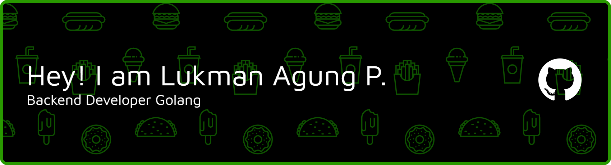

## Hai Guysss.. 👋👋👋👋

     
  <i mg src="https://img.shields.io/badge/Claude-D97757?style=for-the-badge&logo=claude&logoColor=white"> 

#### Media Sosial
 

<!--
**LukmanAP/LukmanAP** is a ✨ _special_ ✨ repository because its `README.md` (this file) appears on your GitHub profile.

Here are some ideas to get you started:

- 🔭 I’m currently working on ...
- 🌱 I’m currently learning ...
- 👯 I’m looking to collaborate on ...
- 🤔 I’m looking for help with ...
- 💬 Ask me about ...
- 📫 How to reach me: ...
- 😄 Pronouns: ...
- ⚡ Fun fact: ...
-->
